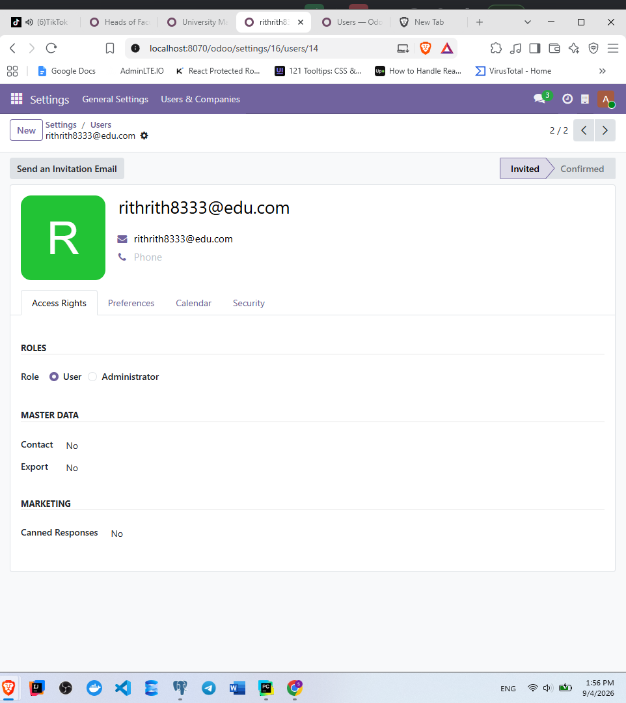

# Local Configuration Guide

This guide configures and runs the `school_management` addon in the local Odoo 19 workspace on Windows.

## 1. Confirm the prerequisites

Use PowerShell from `C:\Odoo\odoo` and confirm that these components are available:

- PostgreSQL is running and accepts connections on `localhost:5432`.
- The PostgreSQL role `odoo` exists. The current local configuration uses an empty password.
- The repository virtual environment exists at `C:\Odoo\odoo\venv`.
- wkhtmltopdf is installed at `C:\Program Files\wkhtmltopdf\bin` if PDF reports are required.

Check the Python environment:

```powershell
Set-Location C:\Odoo\odoo
& .\venv\Scripts\python.exe --version
```

The addon is designed for Odoo 19. Do not use a different Odoo checkout or Python environment without also reviewing the dependency and configuration differences.

## 2. Review the Odoo configuration

The repository already contains [`odoo.conf`](../../../odoo.conf). Its important local values are:

```ini
db_name = odoo
db_host = localhost
db_port = 5432
db_user = odoo
addons_path = C:\Odoo\odoo\addons,C:\Odoo\odoo\odoo\addons,C:\Odoo\odoo\custom
http_port = 8070
```

The configuration also restricts Odoo to the `odoo` database with `dbfilter = ^odoo$` and hides the database selector with `list_db = False`. Keep the `admin_passwd` value private; it controls database-management operations and is separate from the normal Odoo administrator login.

If your PostgreSQL username, password, database name, or ports differ, update `odoo.conf` and the seed script connection settings before continuing.

## 3. Create or verify the database

List databases using the project environment:

```powershell
& .\venv\Scripts\python.exe .\odoo-bin db -c .\odoo.conf --list
```

If the `odoo` database does not exist, initialize it:

```powershell
& .\venv\Scripts\python.exe .\odoo-bin -c .\odoo.conf -d odoo -i base --stop-after-init
```

If this fails with a PostgreSQL authentication or connection error, fix PostgreSQL service status, role permissions, or the values in `odoo.conf` before installing the addon.

## 4. Install the addon

Install `school_management` into the `odoo` database:

```powershell
& .\venv\Scripts\python.exe .\odoo-bin -c .\odoo.conf -d odoo -i school_management --stop-after-init
```

The manifest loads the security groups, access rights, record rules, data, wizards, reports, views, menus, and backend assets. A successful command should finish with exit code `0`.

After installation, start the server:

```powershell
& .\start_odoo.ps1
```

The launcher adds wkhtmltopdf to `PATH` when it is installed. Open [http://localhost:8070/web/login](http://localhost:8070/web/login) in a browser.

## 5. Load optional sample data

The module can be used with manually entered records. For a populated local demonstration database, load the SQL seed after the module has been installed:

```powershell
Set-Location C:\Odoo\odoo
& .\venv\Scripts\python.exe .\custom\school_management\seed\run_seed.py
```

The script connects to `localhost:5432`, database `odoo`, as PostgreSQL user `odoo`. It is intentionally not part of the Odoo module install process. Do not run it against production data.

The seed uses fixed IDs and `ON CONFLICT (id) DO NOTHING`, so rerunning it does not replace existing records. If the database schema has changed or the seed references missing tables, upgrade the module first and inspect the error before retrying.

## 6. Configure users and roles

The addon defines School User, Student, Teacher, HOD, Dean, and School Admin groups. Record rules scope access through the chain:

```text
res.users -> teacher_id -> teacher -> department/faculty
```

To configure a real user:

1. Log in as an administrator.
2. Open **Settings -> Users** and create or open a user.
3. Assign the appropriate school group(s).
4. For a teacher, HOD, or Dean, set the user’s `teacher_id` link to the matching teacher record.
5. For a Dean, ensure that the linked teacher is the dean of the intended faculty.
6. Save, sign out, and test with the target user account.

The verified local demo accounts are documented in [`test_credentials.md`](test_credentials.md). Change those passwords before sharing the database or exposing the server beyond the local machine.

llllllll/';
Use the application menus in this order so required relationships are available:

1. **Structure**: faculties, departments, programs, subjects, and classrooms.
2. **Academic**: academic years, semesters, and semester subjects.
3. **Teachers** and **Students**.
4. **Academic**: class sections and academic assignments.
5. **Enrollment**: enroll students into class sections, either directly or through the enrollment wizard.
6. **Finance**: create fee invoices, add fee lines, post the invoice, then create and post payments.

For finance testing, a payment must have a positive amount. If a fee is linked, its student must match the payment student. Posted and canceled payments are protected from direct edits.

## 8. Verify the installation

Check these application areas while logged in as the administrator:

- The **Dashboard** opens and displays student, teacher, department, enrollment, fee, and payment KPIs.
- The **Structure**, **Academic**, **Students**, **Teachers**, **Enrollment**, and **Finance** menus are visible.
- A payment receipt can be generated from a posted payment.
- A curriculum report can be opened from the relevant academic records.
- A teacher, HOD, Dean, and Student user can only see the records allowed by their assigned role and links.

Run the focused addon tests when the database is available:

```powershell
& .\venv\Scripts\python.exe .\odoo-bin -c .\odoo.conf -d odoo --test-enable -i school_management --stop-after-init
```

For a code-only upgrade followed by the tests, use:

```powershell
& .\venv\Scripts\python.exe .\odoo-bin -c .\odoo.conf -d odoo -u school_management --test-enable --stop-after-init
```

## 9. Upgrade after code changes

Stop the running Odoo server, then upgrade the addon:

```powershell
Set-Location C:\Odoo\odoo
& .\venv\Scripts\python.exe .\odoo-bin -c .\odoo.conf -d odoo -u school_management --stop-after-init
```

Start Odoo again with `& .\start_odoo.ps1`. If browser assets appear stale after JavaScript or SCSS changes, reload the page with the browser’s hard-refresh action or start Odoo with the relevant asset-development options used by your workflow.

## Troubleshooting

### `school_management` is not found

Confirm that `C:\Odoo\odoo\custom` is present in `addons_path`, then update the module list from the Apps screen or restart Odoo and repeat the install command.

### PostgreSQL connection fails

Confirm the PostgreSQL service is running, the `odoo` role can connect to database `odoo`, and `db_host`, `db_port`, `db_user`, and `db_password` match the local server.

### The database selector or database manager is unavailable

This is expected with `list_db = False` and the locked `dbfilter`. Use the configured `odoo` database, or temporarily change those settings only for controlled local administration.

### A role sees too many or too few records

Check the user’s assigned groups and `teacher_id` first. Also verify the teacher’s department, faculty, HOD status, and dean assignment. Sign out and back in after changing access groups.

### A report fails to render

Install wkhtmltopdf and verify that `C:\Program Files\wkhtmltopdf\bin` exists. The supplied `start_odoo.ps1` adds that directory to `PATH`.
11

## Related project documents

- [`project_overview.md`](project_overview.md): implemented features, models, security flow, and known boundaries.
- [`agent_guide.md`](agent_guide.md): repository-level Odoo development conventions.
- [`test_credentials.md`](test_credentials.md): local demo accounts.
