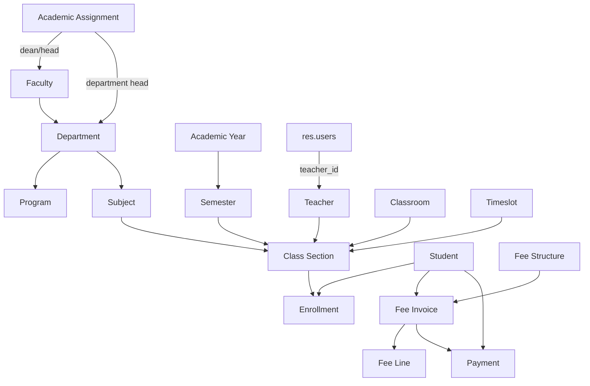

# University Management System - Project Overview

Updated to match the codebase on 2026-09-10.

## Summary

`custom/school_management/` is an Odoo 19 application addon for university operations. It covers structure, academics, admissions, students, teachers, enrollments, class sections, timetables, assignments/lesson plans, grading and assessment, two dashboards (operational + teacher), attendance, and a lightweight finance flow built on standalone fee and payment models rather than the Odoo `account` module.

Manifest facts from `__manifest__.py`:

- Name: `University Management System`
- Category: `Education`
- Version: `19.0.1.2.1`
- Depends: `auth_signup`, `base`, `mail`, `portal`, `web`
- Installable: `True`
- Application: `True`

## System Flow

The implemented system follows this business flow:

1. Structure: faculties, departments, programs, subjects, classrooms.
2. Academic calendar: academic years and semesters.
3. People: teachers and students; admission applications feed student records.
4. Delivery: class sections connect subject, semester, teacher, and room; timetables schedule slots.
5. Registration: enrollments connect students to class sections.
6. Academic work: lesson plans, assignments/submissions, attendance, grading and assessment, report cards and transcripts.
7. Finance: fee structures, fee invoices, and payments belong to students.
8. Visibility and operations: dashboards (operational, student, teacher), reports, portals, and role-based record visibility.

## Implemented Models

### Core business models

- `university.faculty`
- `university.department`
- `university.program`
- `university.subject`
- `university.classroom`
- `university.academic.year`
- `university.semester`
- `university.semester.subject`
- `university.teacher`
- `university.academic.assignment`
- `university.admission.application`
- `university.student`
- `university.enrollment`
- `university.class.section`

### Academic operation models

- `university.lesson.plan`
- `university.assignment`
- `university.assignment.submission`
- `university.timeslot`
- `university.timetable.slot`
- `university.attendance`
- `university.notice.board`
- `university.service.hour`

### Grading and results

- `university.grade.scale`
- `university.grade.scale.line`
- `university.assessment.category`
- `university.assessment.result`
- `university.report.card`
- `university.report.card.line`
- `university.transcript`
- `university.transcript.line`

### Finance

- `university.fee`
- `university.fee.line`
- `university.fee.structure`
- `university.fee.structure.line`
- `university.payment`

### Miscellaneous

- `school.dashboard`
- `university.capability`
- `university.document.signature`

### Model extensions and wizards

- `res.users` is extended in `models/res_users.py` with `teacher_id`.
- `university.student.enrollment.wizard`
- `university.bulk.enrollment.wizard`
- `university.populate.class.wizard`
- `university.timetable.generation.wizard`
- `university.teacher.account.wizard`

## Relationship Map



## Security Flow

The addon loads `security/security.xml` (groups), `security/ir.model.access.csv` (model rights), and `security/record_rules.xml` (record rules). All three are registered in the manifest.

### Groups

Groups are grouped under one privilege, `res.groups.privilege` "University Management":

| Group | Name | Implies |
|---|---|---|
| `group_school_user` | School User | `base.group_user` |
| `group_school_student` | Student | `group_school_user` |
| `group_school_teacher` | Teacher | `group_school_user` |
| `group_school_hod` | Head of Department | `group_school_teacher` |
| `group_school_dean` | Head of Faculty | `group_school_hod` |
| `group_school_admin` | University Administrator | `group_school_dean` |
| `group_teacher_dashboard` | Teacher Dashboard | `group_school_teacher` (standalone, not in the admin chain) |
| `group_student_portal` | Student Portal | `base.group_portal` (external portal role, not `base.group_user`) |

Note: `group_teacher_dashboard` deliberately does **not** sit inside the admin → dean → hod → teacher hierarchy, so administrators do not automatically gain the Teacher Dashboard; only explicitly assigned users see it. This is what hides the Teacher Dashboard menu from `admin`.

### Why `res.users.teacher_id` matters

`models/res_users.py` extends `res.users` with a `teacher_id` Many2one to `university.teacher`. That link is the backbone for organizational record rules.

Examples from `record_rules.xml`:

- Teachers can see their own teacher profile.
- Teachers can see class sections where `teacher_id.user_id = user.id`.
- Teachers can see subjects where they are assigned.
- Teachers can see students and enrollments in their own sections.
- HOD users can see teachers, subjects, and sections inside their headed department.
- Dean users can manage departments, programs/majors, subjects, teachers, and students inside their faculty.
- Students can only read their own profile, enrollments, fees, fee lines, and payments.

This means the real security flow is:

`res.users` -> `teacher_id` -> teacher -> department/faculty -> record rule scope.

With `-u school_management`, `data/fix_user_teacher_links.xml` runs `_fix_demo_staff_links()` to keep the forward (`res.users.teacher_id`) and reverse (`university.teacher.user_id`) links reciprocal for the demo staff. The standalone SQL equivalent is kept in `security/fix_demo_staff_links.sql` (reference only, not loaded by Odoo).

## Finance Flow

The finance layer is a lightweight operational billing workflow. Fee structures (`university.fee.structure` + lines) let the admin predefine fee item templates for an invoice.

### Fee invoice

`university.fee` stores:

- student
- academic year and semester
- fee lines
- related payments
- total amount, paid amount, and balance
- state: `draft`, `posted`, `paid`, `canceled`

`fee._compute_totals()` recalculates:

- `total_amount` from fee lines
- `paid_amount` from posted payments only
- `balance = total_amount - paid_amount`
- state transition back to `posted` if a previously paid invoice becomes unpaid again

### Payment

`university.payment` stores:

- receipt reference from sequence `university.payment`
- required `student_id`
- optional `fee_id`
- date, amount, payment method, reference
- state: `draft`, `posted`, `canceled`

Current code behavior in `models/payment.py`:

- Amount must be strictly positive by backend constraint.
- If `fee_id` is set, the fee must belong to the same student by backend constraint.
- Posted and canceled payments are protected by `write()` and cannot be edited directly.
- State changes should go through `action_post()`, `action_cancel()`, and `action_draft()`.
- The payment form is readonly once the payment leaves `draft`.

### Payment workflow

1. Create fee invoice in `draft` (optionally from a fee structure).
2. Add fee lines.
3. Confirm fee invoice to `posted`.
4. Create payment for the same student.
5. Optionally link the payment to the posted fee invoice.
6. Confirm payment to `posted`.
7. Fee totals recompute automatically.
8. If balance reaches zero or below and total is positive, the fee moves to `paid`.

### Known finance boundaries

This is not a full accounting ledger. It does not yet implement:

- scholarships
- refunds/reversals
- reconciliation
- accounting journal entries
- currency conversion

## Student Flow

`university.student` is the identity and aggregation record, not the place where every academic transaction is stored directly.

Student-related behavior in code:

- enrollments are stored in `university.enrollment`
- fees are stored in `university.fee`
- payments are stored in `university.payment`
- fee summary fields on the student aggregate posted/paid fee invoices
- academic placement (department/faculty) derives from the selected program

## Dashboard

The addon ships three OWL dashboard shells under `static/src/school_management/`:

- **Operational dashboard** (`school.dashboard` + `dashboard_shell`) — KPI counts and finance totals with actions that open the corresponding models.
- **Student dashboard shell** (`student_dashboard_shell`) — the student-facing start screen.
- **Teacher dashboard shell** (`teacher_dashboard_shell`) — the teacher-facing start screen, gated by `group_teacher_dashboard`.

The custom `layout/school_layout.js` wraps the sidebar; the Teacher Dashboard entry is only shown to users with `group_teacher_dashboard` (system administrators are intentionally excluded). The backend also patches the webclient topbar/sidebar via `layout/webclient_patch.js`.

## Reports

The manifest loads these report files:

- `reports/payment_report_template.xml` and `reports/payment_report.xml` — payment receipt.
- `reports/curriculum_report_template.xml` and `reports/curriculum_report.xml` — curriculum report.
- `reports/academic_report_templates.xml` and `reports/academic_reports.xml` — academic reports (report card / transcript).

The payment receipt action is `school_management.action_report_university_payment_receipt`.

## Menu and UI Areas

Main areas:

- University root menu with Dashboard, Teacher Dashboard, Structure, Students, Teachers, Academic, Enrollment, Finance, Grading, Attendance, and the teacher-portal menus (Lesson Plans, Assignments, Timetables, Notice Board, Service Hours).
- Dedicated **Student Portal** root menu for backend students (`group_school_student`).
- A separate student **portal** flow is scaffolded: `views/portal_templates.xml` is currently a placeholder for portal pages, and `group_student_portal` (implies `base.group_portal`) grants read-only access to the student's own records.

## Migrations

- `migrations/19.0.1.2.0/pre-migrate.py`
- `migrations/19.0.1.2.1/pre-migrate.py` — repairs student academic placement to match their program, clears stale dean/head assignments, and de-duplicates student IDs before the new unique index is enforced.

Upgrade with `-u school_management` so the pre-migrations and `data/fix_user_teacher_links.xml` run.

## Current Status by Area

- Structure: implemented
- Teacher/student master data: implemented
- Admission applications: implemented
- Academic year and semester: implemented
- Class sections and classrooms: implemented
- Timetables: implemented (timeslots + timetable slots)
- Enrollment: implemented with wizard support
- Lesson plans, assignments/submissions, attendance, notice board, service hours: implemented
- Grading, assessment results, report cards, transcripts: implemented
- Finance: implemented as lightweight fee/payment flow with fee structures
- Dashboard: implemented with KPIs and role-specific shells
- Security roles and record scoping: implemented
- Student portal pages (`views/portal_templates.xml`): placeholder — planned
- Schedule conflicts, scholarships, graduation, certificates: planned

## Dean Access Rule

The intended dean scope is faculty-level management. A Dean user is linked to a teacher record through `res.users.teacher_id`, and the faculty points to that same teacher through `faculty.dean_id` (derived from active academic assignments).

Current implemented Dean access:

- Departments where `faculty_id.dean_id.user_id = user.id`
- Programs/majors where `department_id.faculty_id.dean_id.user_id = user.id`
- Subjects where `department_id.faculty_id.dean_id.user_id = user.id`
- Teachers where `department_id.faculty_id.dean_id.user_id = user.id`
- Students where `department_id.faculty_id.dean_id.user_id = user.id`

## Verification Notes

As of 2026-09-10:

- The module upgrades successfully with `-u school_management` (version `19.0.1.2.1`).
- Focused payment tests exist in `tests/test_payment.py`.
- The user ↔ teacher link data-integrity fix is defined in `data/fix_user_teacher_links.xml` (see also `security/fix_demo_staff_links.sql`).

## File Map

```text
school_management/
|-- __manifest__.py
|-- __init__.py
|-- models/
|   |-- __init__.py
|   |-- academic_assignment.py
|   |-- academic_year.py
|   |-- admission.py
|   |-- assignment.py
|   |-- attendance.py
|   |-- capability.py
|   |-- classroom.py
|   |-- class_section.py
|   |-- dashboard.py
|   |-- department.py
|   |-- document_signature.py
|   |-- enrollment.py
|   |-- faculty.py
|   |-- fee.py
|   |-- grading.py
|   |-- lesson_plan.py
|   |-- notice_board.py
|   |-- payment.py
|   |-- program.py
|   |-- res_config_settings.py
|   |-- res_users.py
|   |-- semester_subject.py
|   |-- service_hour.py
|   |-- student.py
|   |-- subject.py
|   |-- teacher.py
|   `-- timetable.py
|-- security/
|   |-- security.xml
|   |-- ir.model.access.csv
|   |-- record_rules.xml
|   `-- fix_demo_staff_links.sql      (reference only, not loaded by Odoo)
|-- data/
|   |-- cleanup_legacy_models.xml
|   |-- dashboard_data.xml
|   |-- fee_sequence.xml
|   |-- academic_defaults.xml
|   |-- mail_template.xml
|   |-- university_capability_data.xml
|   `-- fix_user_teacher_links.xml
|-- migrations/
|   |-- 19.0.1.2.0/pre-migrate.py
|   `-- 19.0.1.2.1/pre-migrate.py
|-- wizard/
|   |-- bulk_enrollment_wizard.py + views
|   |-- student_enrollment_wizard.py + views
|   |-- populate_class_wizard.py + views
|   |-- timetable_generation_wizard.py + views
|   `-- teacher_account_wizard.py + views
|-- reports/
|   |-- payment_report_template.xml / payment_report.xml
|   |-- curriculum_report_template.xml / curriculum_report.xml
|   `-- academic_report_templates.xml / academic_reports.xml
|-- views/
|   |-- (faculty, department, program, subject, classroom, class_section,
|   |--  academic_year, semester_subject, academic_assignment, teacher,
|   |--  student, enrollment, fee, payment, admission, capability, grading,
|   |--  lesson_plan, assignment, timetable, notice_board, service_hour,
|   |--  document_signature, dashboard, teacher_dashboard_shell_actions,
|   |--  school_dashboard_shell_actions, res_config_settings, menu_views,
|   |--  portal_templates — placeholder)
|-- static/
|   `-- src/school_management/
|       |-- backend.scss
|       |-- dashboard_shell.{js,xml,scss}
|       |-- student_dashboard_shell.{js,xml,scss}
|       |-- teacher_dashboard_shell.{js,xml,scss}
|       `-- layout/school_layout.{js,xml,scss} + webclient_patch.{js,xml} + topbar_integration.scss
|-- tests/
|   |-- __init__.py
|   `-- test_payment.py
|-- seed/
|   |-- run_seed.py
|   `-- seed_data.sql
`-- document/
    |-- project_overview.md
    |-- project_structure.md.md
    |-- agent_guide.md
    |-- local_configuration_guide.md
    |-- login_guide.md
    |-- university_management_system_architecture.md
    `-- SCHOOL_MANAGEMENT_QNA_REVIEW_9b9dd9a6.md
```