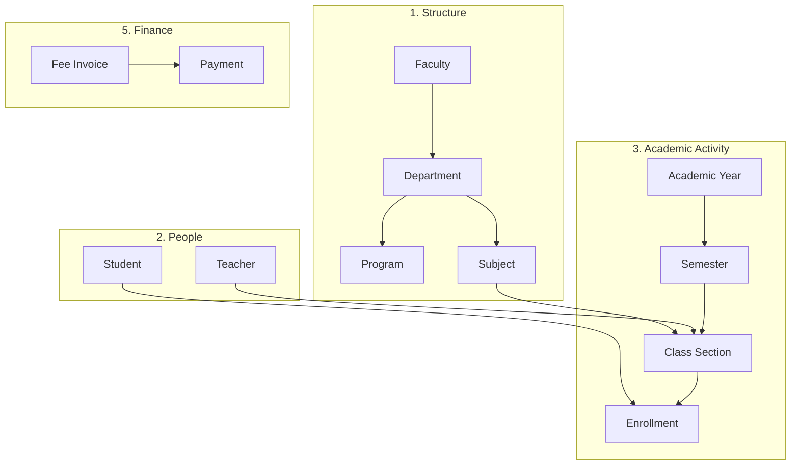
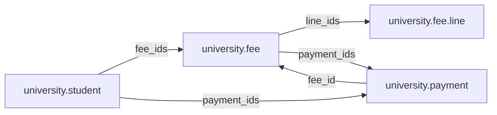
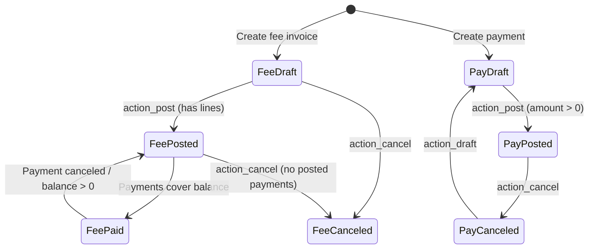

# University Management System — Project Overview

An **Odoo 19** custom addon at `custom/school_management/` — a university ERP for structure, academics, students, teachers, enrollments, and basic finance. It is marked as an application (`application: True`) and depends on `base` and `mail`.

---

## Architecture (5 Layers)

The design doc (`university_management_system_architecture.md`) describes five layers:



---

## Implemented Models (13)

| Model | Purpose |
|-------|---------|
| `university.faculty` | Top-level org unit (dean, departments) |
| `university.department` | Under faculty (programs, teachers, subjects) |
| `university.program` | Degree programs (bachelor/master/etc.) |
| `university.academic.year` | Academic years with semesters |
| `university.semester` | Semesters within a year |
| `university.subject` | Subjects (credits, department) |
| `university.class.section` | Section of a subject (teacher, semester, room, capacity) |
| `university.teacher` | Instructors (department, class sections) |
| `university.student` | Students (identity, academic info, fees) |
| `university.enrollment` | Student ↔ class section link (status: enrolled/completed/dropped) |
| `university.classroom` | Rooms (building, capacity, type) |
| `university.fee` + `university.fee.line` | Fee invoices with line items |
| `university.payment` | Payments against fee invoices |
| `school.dashboard` | KPI dashboard (counts + fee totals) |

---

## Key Design Decisions

1. **Enrollment goes through class sections** — Students don't link directly to subjects. They enroll in a `university.class.section`, which carries subject, teacher, and semester via related fields.

2. **Subject ≠ Class Section** — One subject (e.g. "Database") can have multiple sections (A, B, C) with different teachers.

3. **Student holds identity, not everything** — Academic history lives in enrollments; fees/payments are separate transaction records.

4. **No `university.course` model** — The structure is Faculty → Department → Program → Subject; subjects link directly to programs and departments.

---

## Menu Structure

```
University (root)
├── Dashboard
├── Structure → Faculties, Departments, Programs
├── Students → All Students
├── Teachers → All Teachers
├── Academic → Academic Years, Semesters, Subjects, Class Sections, Classrooms
├── Enrollment → Enrollments
└── Finance → Fee Invoices, Payments
```

---

## What's Built vs. Planned

| Phase | Status |
|-------|--------|
| **Phase 1** — Faculty, Department, Program, Subject, Student | Done |
| **Phase 2** — Academic Year, Semester, Enrollment, Class Section, Teacher | Done |
| **Phase 3** — Classroom | Done |
| **Phase 3** — Schedule, Attendance | Not started |
| **Phase 4** — Exam, Assessment, Result, Grade, GPA | Not started |
| **Phase 5** — Fee, Payment | Done |
| **Phase 5** — Scholarship | Not started |
| **Phase 6** — Graduation, Certificate, Transcript | Not started |
| **Phase 7** — Dashboard | Basic (counts only, no charts) |
| **Phase 7** — Security roles | Minimal (`base.group_user` only; `security.xml` group exists but isn't loaded in manifest) |

---

## Notable Details

- **Class section** (`class_section_views.xml`) — List/form/search views with enrolled students tab, active/archived filters.
- **Finance flow** — Fee invoices use sequences (`INV-001`), states (draft → posted → paid), and payments update balances automatically.
- **Legacy cleanup** — `cleanup_legacy_models.xml` is a no-op placeholder after renaming `school.*` → `university.*`.
- **Security** — All models grant full CRUD to `base.group_user`; no record rules or role-based access yet.

---

## Data Flow Example

```
Student "Sothearith"
  → Enrollment in "CS101-Section A"
      → Class Section links: Subject=Database, Teacher=Mr. Dara, Semester=2026-S1
  → Fee Invoice INV-0001 (tuition, registration, etc.)
      → Payment PAY-0001 → balance updates → invoice marked paid
```

---

## Finance Module

The finance layer handles student billing without Odoo Accounting (`account` module). Invoices and payments are standalone transaction records linked to students.

### Finance Relationship Diagram



### Sequence Numbers

Defined in `data/fee_sequence.xml`:

| Model | Sequence Code | Prefix | Example |
|-------|---------------|--------|---------|
| `university.fee` | `university.fee` | `INV-` | `INV-0001` |
| `university.payment` | `university.payment` | `PAY-` | `PAY-0001` |

Both models auto-assign the reference on `create()` when `name` is `"New"`.

---

### `university.fee` — Fee Invoice

**File:** `models/fee.py`

| Field | Type | Description |
|-------|------|-------------|
| `name` | Char | Invoice reference (auto-generated, readonly) |
| `student_id` | Many2one | Required link to student |
| `academic_year_id` | Many2one | Optional academic year |
| `semester_id` | Many2one | Optional semester |
| `date` | Date | Invoice date (default: today) |
| `due_date` | Date | Payment due date |
| `currency_id` | Many2one | Company currency (computed) |
| `line_ids` | One2many | Fee line items |
| `payment_ids` | One2many | Related payments |
| `total_amount` | Float | Sum of line amounts (stored, computed) |
| `paid_amount` | Float | Sum of posted payments (stored, computed) |
| `balance` | Float | `total_amount - paid_amount` (stored, computed) |
| `state` | Selection | `draft` → `posted` → `paid` / `canceled` |

#### Fee States

| State | Meaning |
|-------|---------|
| `draft` | Editable; lines can be added/removed |
| `posted` | Confirmed invoice; awaiting payment |
| `paid` | Fully paid (`balance <= 0` and `total > 0`) |
| `canceled` | Voided; cannot have posted payments |

#### Fee Actions

| Method | Button Label | Rules |
|--------|--------------|-------|
| `action_post()` | Confirm | Requires at least one fee line |
| `action_cancel()` | Cancel | Blocked if any posted payments exist |
| `action_draft()` | Reset to Draft | Sets state back to `draft` |

#### `university.fee.line` — Fee Line

| Field | Type | Description |
|-------|------|-------------|
| `fee_id` | Many2one | Parent invoice (cascade delete) |
| `name` | Char | Line description (e.g. Tuition, Registration) |
| `amount` | Float | Line amount |

**Example invoice:**

```
INV-0001 — Student: Sothearith

  Tuition         $500
  Registration     $50
  Library          $20
  ─────────────────────
  Total           $570
  Paid            $570
  Balance           $0
  Status: paid
```

---

### `university.payment` — Student Payment

**File:** `models/payment.py`

| Field | Type | Description |
|-------|------|-------------|
| `name` | Char | Receipt reference (auto-generated, readonly) |
| `student_id` | Many2one | Required link to student |
| `fee_id` | Many2one | Optional fee invoice (domain: same student, state = posted) |
| `date` | Date | Payment date (default: today) |
| `currency_id` | Many2one | Company currency (computed) |
| `amount` | Float | Payment amount (required) |
| `payment_method` | Selection | `cash`, `bank_transfer`, `credit_card`, `check` |
| `reference` | Char | External transaction reference |
| `state` | Selection | `draft` → `posted` / `canceled` |

#### Payment States

| State | Meaning |
|-------|---------|
| `draft` | Editable; not counted toward invoice balance |
| `posted` | Confirmed; counted in `fee.paid_amount` |
| `canceled` | Voided; excluded from totals |

#### Payment Actions

| Method | Button Label | Rules |
|--------|--------------|-------|
| `action_post()` | Confirm | Amount must be > 0; triggers fee `_compute_totals()` |
| `action_cancel()` | Cancel | Triggers fee `_compute_totals()` to recalculate balance |
| `action_draft()` | Reset to Draft | Sets state back to `draft` |

#### Key Logic in `payment.py`

```python
# Auto-generate receipt number on create
@api.model
def create(self, vals):
    if vals.get("name", "New") == "New":
        vals["name"] = self.env["ir.sequence"].next_by_code("university.payment") or "New"
    return super().create(vals)

# Posting validates amount and updates linked fee invoice
def action_post(self):
    for payment in self:
        if payment.amount <= 0:
            raise ValidationError("Payment amount must be strictly positive.")
        payment.state = "posted"
        if payment.fee_id:
            payment.fee_id._compute_totals()
```

#### Fee Invoice Domain on Payment Form

The `fee_id` field only shows invoices where:

- `student_id` matches the selected student
- `state` is `posted` (open invoices only)

This prevents paying draft or already-canceled invoices from the payment form.

---

### End-to-End Finance Workflow



**Typical steps:**

1. Create a **fee invoice** for a student in `draft`.
2. Add **fee lines** (Tuition, Registration, Library, etc.).
3. Click **Confirm** → invoice moves to `posted`.
4. Create a **payment** linked to the student and the posted invoice.
5. Enter amount and payment method, then click **Confirm** → payment moves to `posted`.
6. Fee invoice `_compute_totals()` runs automatically:
   - `paid_amount` = sum of posted payments
   - `balance` = `total_amount - paid_amount`
   - If `balance <= 0` and `total > 0` → invoice state becomes `paid`

**Partial payments:** Multiple posted payments can be applied to one invoice until `balance` reaches zero.

**Overpayment:** If total payments exceed the invoice total, `balance` goes negative and the invoice still transitions to `paid`.

---

### Student Fee Totals

**File:** `models/student.py`

The student form shows aggregated fee metrics (computed from posted/paid invoices only):

| Field | Calculation |
|-------|-------------|
| `fee_total` | Sum of `total_amount` on fees with state `posted` or `paid` |
| `fee_paid` | Sum of `paid_amount` on those fees |
| `fee_balance` | Sum of `balance` on those fees |

Draft and canceled invoices are excluded from student totals.

---

### Dashboard Finance KPIs

**File:** `models/dashboard.py`

| Metric | Source |
|--------|--------|
| `fee_count` | Count of all fee invoices |
| `payment_count` | Count of all payments |
| `total_unpaid_fees` | Sum of `balance` on fees with state `posted` or `paid` |
| `total_paid_fees` | Sum of `amount` on payments with state `posted` |
| `total_scholarships` | Placeholder (`0.0`) — not implemented yet |

Dashboard action `action_open_unpaid_fees()` opens fees where `state = posted` and `balance > 0`.

---

### Finance Views

| File | Views |
|------|-------|
| `views/fee_views.xml` | List, form (fee lines + payments tabs), search, window action |
| `views/payment_views.xml` | List, form (statusbar + confirm/cancel buttons), search, window action |

**UI behavior:**

- Fee lines are editable only in `draft` state.
- Payment and fee form fields become readonly after posting (except reset/cancel actions).
- List views use badge widgets for state with color decorations.

---

### Finance Business Rules Summary

| Rule | Enforced In |
|------|-------------|
| Cannot post fee without lines | `fee.action_post()` |
| Cannot cancel fee with posted payments | `fee.action_cancel()` |
| Payment amount must be positive | `payment.action_post()` |
| Only posted payments count toward balance | `fee._compute_totals()` |
| Invoice auto-marks `paid` when balance ≤ 0 | `fee._compute_totals()` |
| Invoice reverts to `posted` if balance > 0 after being paid | `fee._compute_totals()` |
| Payment `fee_id` limited to posted invoices for same student | `payment.fee_id` domain |

---

### Future Finance Work (Not Yet Built)

- Scholarship model and discount logic
- Integration with Odoo `account` module for real accounting
- Payment reconciliation and refund workflow
- Fee templates / automatic invoice generation per semester
- Currency conversion for international students

---

## Module File Structure

```
school_management/
├── __manifest__.py
├── __init__.py
├── data/
│   ├── cleanup_legacy_models.xml
│   ├── dashboard_data.xml
│   └── fee_sequence.xml
├── document/
│   ├── agent_guide.md
│   ├── project_structure.md.md
│   ├── university_management_system_architecture.md
│   └── project_overview.md
├── models/
│   ├── academic_year.py
│   ├── class_section.py
│   ├── classroom.py
│   ├── dashboard.py
│   ├── department.py
│   ├── enrollment.py
│   ├── faculty.py
│   ├── fee.py
│   ├── payment.py
│   ├── program.py
│   ├── student.py
│   ├── subject.py
│   └── teacher.py
├── security/
│   ├── ir.model.access.csv
│   └── security.xml
└── views/
    ├── academic_year_views.xml
    ├── class_section_views.xml
    ├── classroom_views.xml
    ├── dashboard_views.xml
    ├── department_views.xml
    ├── enrollment_views.xml
    ├── faculty_views.xml
    ├── fee_views.xml
    ├── menu_views.xml
    ├── payment_views.xml
    ├── program_views.xml
    ├── student_views.xml
    ├── subject_views.xml
    └── teacher_views.xml
```

---

## Related Documentation

- `university_management_system_architecture.md` — Full target architecture and implementation phases
- `project_structure.md.md` — Menu and model naming reference
- `agent_guide.md` — Odoo 19 development guide for AI agents
