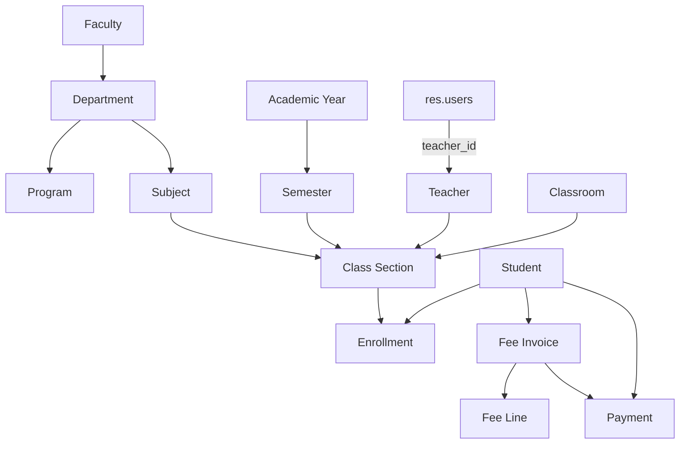

# University Management System - Project Overview

Updated to match the codebase on 2026-09-04.

## Summary

`custom/school_management/` is an Odoo 19 application addon for university operations. It covers structure, academics, students, teachers, enrollments, a dashboard, and a lightweight finance flow built on standalone fee and payment models rather than the Odoo `account` module.

Manifest facts from `__manifest__.py`:

- Name: `University Management System`
- Version: `19.0.1.1.0`
- Depends: `base`, `mail`, `web`
- Installable: `True`
- Application: `True`

## System Flow

The implemented system follows this business flow:

1. Structure: faculties, departments, programs, subjects, classrooms.
2. Academic calendar: academic years and semesters.
3. People: teachers and students.
4. Delivery: class sections connect subject, semester, teacher, and room.
5. Registration: enrollments connect students to class sections.
6. Finance: fee invoices belong to students; payments belong to students and can link to fee invoices.
7. Visibility and operations: dashboard KPIs, reports, and role-based record visibility.

## Implemented Models

### Core business models

- `university.faculty`
- `university.department`
- `university.program`
- `university.subject`
- `university.classroom`
- `university.academic.year`
- `university.semester`
- `university.semester.subject`
- `university.teacher`
- `university.student`
- `university.class.section`
- `university.enrollment`
- `university.academic.assignment`
- `university.fee`
- `university.fee.line`
- `university.payment`
- `school.dashboard`

### Model extensions and wizards

- `res.users` is extended in `models/res_users.py` with `teacher_id`.
- `university.enrollment.wizard`
- `university.student.enrollment.wizard`

## Relationship Map



## Security Flow

The security model is not only `base.group_user` anymore. The addon loads both `security/security.xml` and `security/record_rules.xml`.

### Groups

The addon defines these role groups:

- `group_school_user`
- `group_school_student`
- `group_school_teacher`
- `group_school_hod`
- `group_school_dean`
- `group_school_admin`

### Why `res.users.teacher_id` matters

`models/res_users.py` extends `res.users` with a `teacher_id` Many2one to `university.teacher`. That link is the backbone for organizational record rules.

Examples from `record_rules.xml`:

- Teachers can see their own teacher profile.
- Teachers can see class sections where `teacher_id.user_id = user.id`.
- Teachers can see subjects where they are assigned.
- HOD users can see teachers, subjects, and sections inside their headed department.
- Dean users can see departments, teachers, and students inside their faculty.

This means the real security flow is:

`res.users` -> `teacher_id` -> teacher -> department/faculty -> record rule scope.

## Finance Flow

The finance layer is a lightweight operational billing workflow.

### Fee invoice

`university.fee` stores:

- student
- academic year and semester
- fee lines
- related payments
- total amount, paid amount, and balance
- state: `draft`, `posted`, `paid`, `canceled`

`fee._compute_totals()` recalculates:

- `total_amount` from fee lines
- `paid_amount` from posted payments only
- `balance = total_amount - paid_amount`
- state transition back to `posted` if a previously paid invoice becomes unpaid again

### Payment

`university.payment` stores:

- receipt reference from sequence `university.payment`
- required `student_id`
- optional `fee_id`
- date, amount, payment method, reference
- state: `draft`, `posted`, `canceled`

Current code behavior in `models/payment.py`:

- Amount must be strictly positive by backend constraint.
- If `fee_id` is set, the fee must belong to the same student by backend constraint.
- Posted and canceled payments are protected by `write()` and cannot be edited directly.
- State changes should go through `action_post()`, `action_cancel()`, and `action_draft()`.
- The payment form is readonly once the payment leaves `draft`.

### Payment workflow

1. Create fee invoice in `draft`.
2. Add fee lines.
3. Confirm fee invoice to `posted`.
4. Create payment for the same student.
5. Optionally link the payment to the posted fee invoice.
6. Confirm payment to `posted`.
7. Fee totals recompute automatically.
8. If balance reaches zero or below and total is positive, the fee moves to `paid`.

### Known finance boundaries

This is not a full accounting ledger. It does not yet implement:

- scholarships
- refunds/reversals
- reconciliation
- accounting journal entries
- currency conversion

## Student Flow

`university.student` is the identity and aggregation record, not the place where every academic transaction is stored directly.

Student-related behavior in code:

- enrollments are stored in `university.enrollment`
- fees are stored in `university.fee`
- payments are stored in `university.payment`
- fee summary fields on the student aggregate posted/paid fee invoices

## Dashboard

`school.dashboard` computes summary counts and finance KPIs.

Current examples:

- student count
- teacher count
- department count
- enrollment count
- fee count
- payment count
- total unpaid fees from posted/paid fee balances
- total paid fees from posted payments

The dashboard also exposes actions that open the corresponding models.

## Reports

The manifest loads these report files before the related views that use them:

- `reports/payment_report_template.xml`
- `reports/payment_report.xml`
- `reports/curriculum_report_template.xml`
- `reports/curriculum_report.xml`

The payment receipt action is `school_management.action_report_university_payment_receipt`.

## Menu and UI Areas

The module loads these main areas:

- Dashboard
- Structure
- Students
- Teachers
- Academic
- Enrollment
- Finance

The backend also includes a custom dashboard shell and layout assets under `static/src/school_management/`.

## Current Status by Area

- Structure: implemented
- Teacher/student master data: implemented
- Academic year and semester: implemented
- Class sections and classrooms: implemented
- Enrollment: implemented with wizard support
- Finance: implemented as lightweight fee/payment flow
- Dashboard: implemented with KPIs and recent activity
- Security roles and record scoping: partially implemented
- Schedule, attendance, exams, grades, GPA, scholarships, graduation: planned

## Verification Notes

As of 2026-09-04:

- The module upgrades successfully with `-u school_management`.
- Focused payment tests exist in `tests/test_payment.py`.
- The payment tests pass in the local `odoo` database.

## File Map

```text
school_management/
|-- __manifest__.py
|-- models/
|   |-- academic_assignment.py
|   |-- academic_year.py
|   |-- classroom.py
|   |-- class_section.py
|   |-- dashboard.py
|   |-- department.py
|   |-- enrollment.py
|   |-- faculty.py
|   |-- fee.py
|   |-- payment.py
|   |-- program.py
|   |-- res_users.py
|   |-- semester_subject.py
|   |-- student.py
|   |-- subject.py
|   `-- teacher.py
|-- security/
|   |-- security.xml
|   |-- ir.model.access.csv
|   `-- record_rules.xml
|-- wizard/
|   |-- enrollment_wizard_views.xml
|   `-- student_enrollment_wizard_views.xml
|-- reports/
|   |-- payment_report_template.xml
|   |-- payment_report.xml
|   |-- curriculum_report_template.xml
|   `-- curriculum_report.xml
|-- views/
|-- static/
|-- tests/
|   |-- __init__.py
|   `-- test_payment.py
`-- document/
```